# Notes from Colt's Class

## Data Structures

### Trees

- Data Structures that consist of Nodes in a Parent/Child relationship.
- Trees are non-linear
  - There are many paths you can take 
- Nodes do not point to siblings
- Trees only have one root

#### **ROOT**

- The top of the tree, there is only one root.

#### **CHILD**

- A Node directly connected to another Node when moving away from the Root.

#### **PARENT**

- The converse notion of a child

#### **SIBLINGS**

- A group of Nodes with the same parent.

#### **LEAF**

- Is a Node with no children.

#### **EDGE**

- The connection between one Node and another.

### The Tree - A Visual

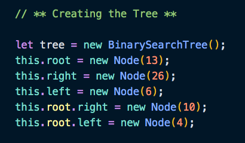

### Types of Trees

- **HTML DOM (Document Object Model)**

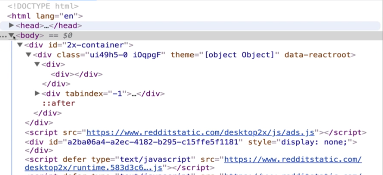

- **Network Routing**

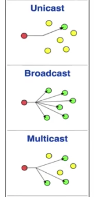

- **Artificial Inteligence (AI)**

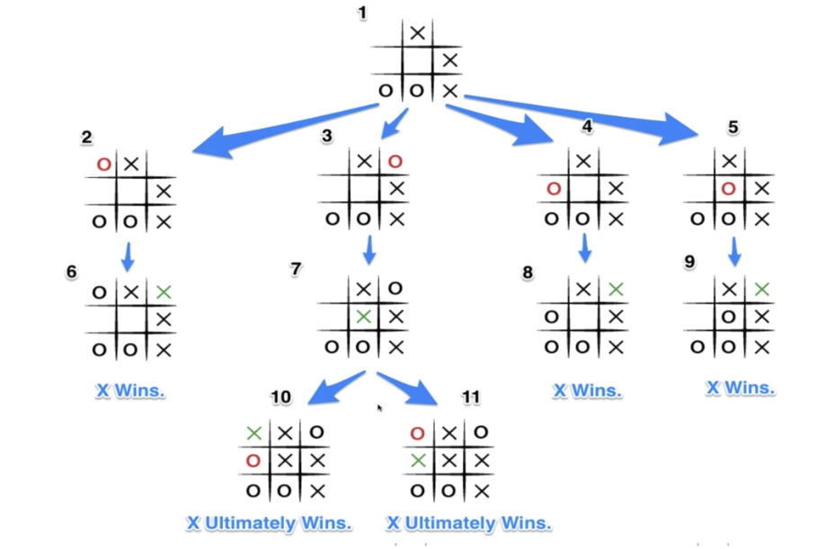

- **Abstract Syntax Tree**

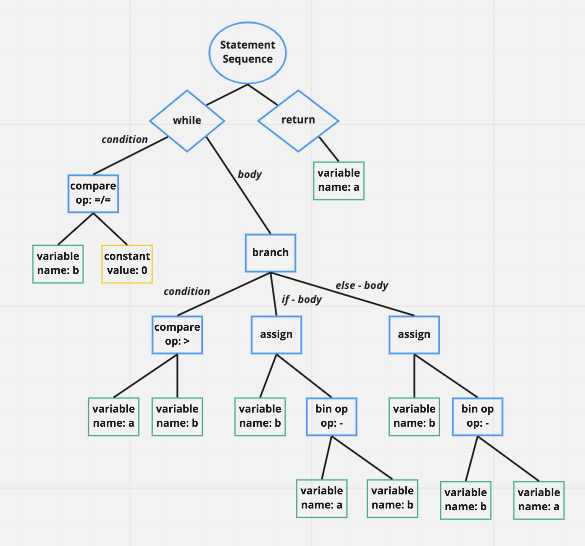

- **Folders in Operating Systems**

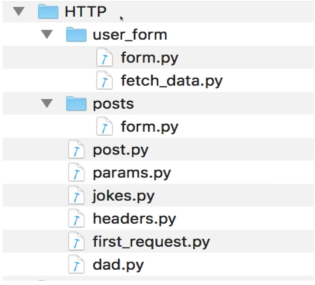

- **JSON**

### Binary Search Trees (BST)

- Optimized for searching.
  - Each Node can have at most **TWO** children.
  - Sorted in a *specific* way, kept in an order.
  - Used to store data that can be compared, that is sortable.
- Every Node that is *less* than the Parent Node, is **always** located to the **left**.
- Every Node that is *greater* than the Parent Node, is **always** located to the **right**.

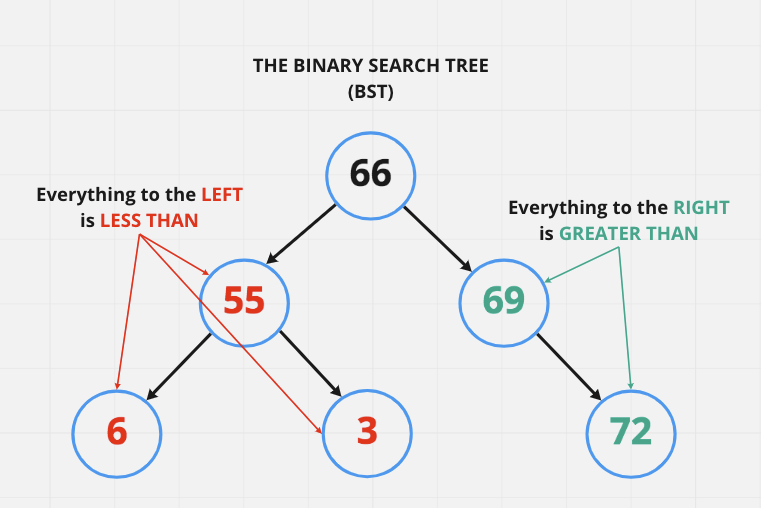

#### Creating the BST class

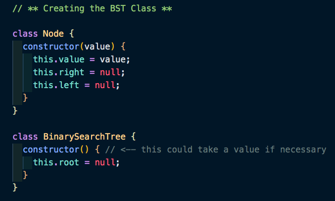

#### Creating the Tree

### The Insert() Method

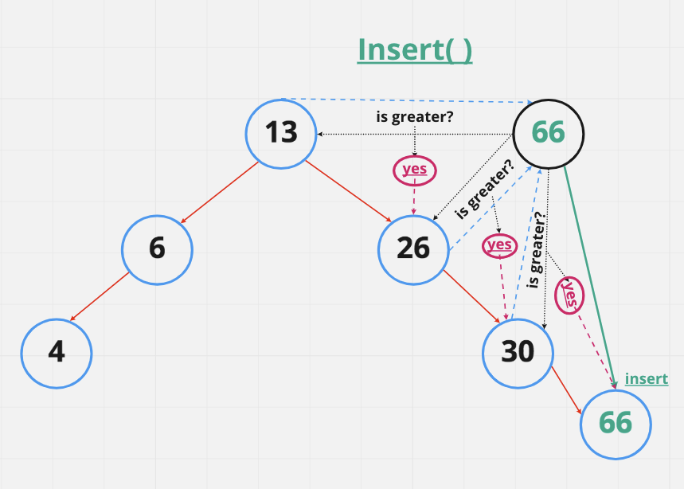

#### Code Example

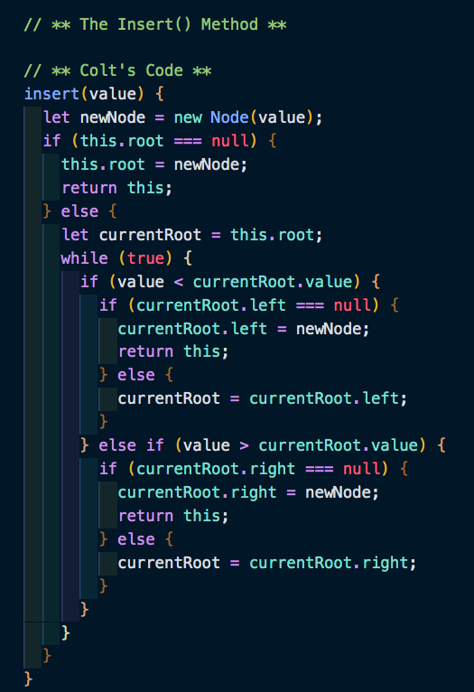

### Searching a BST (or Find, same same)

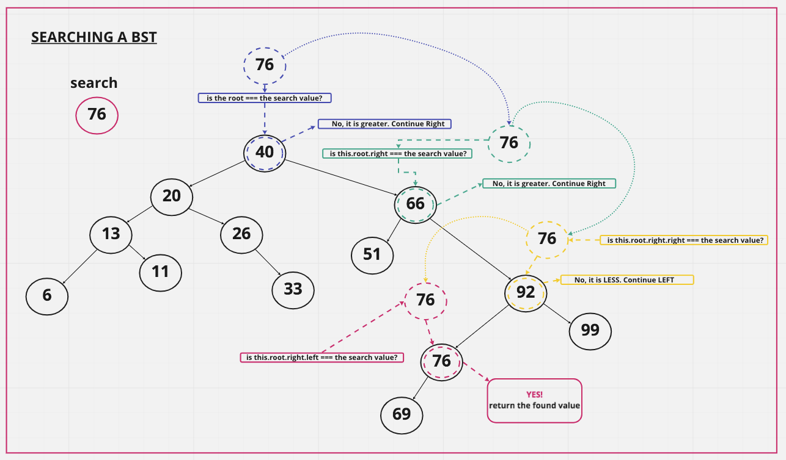

#### Code Example

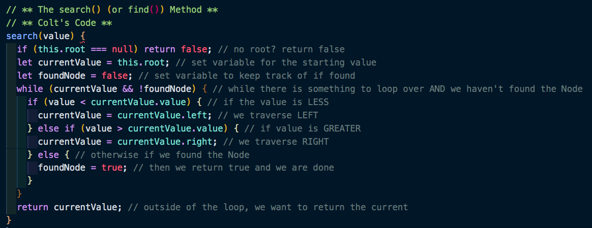
