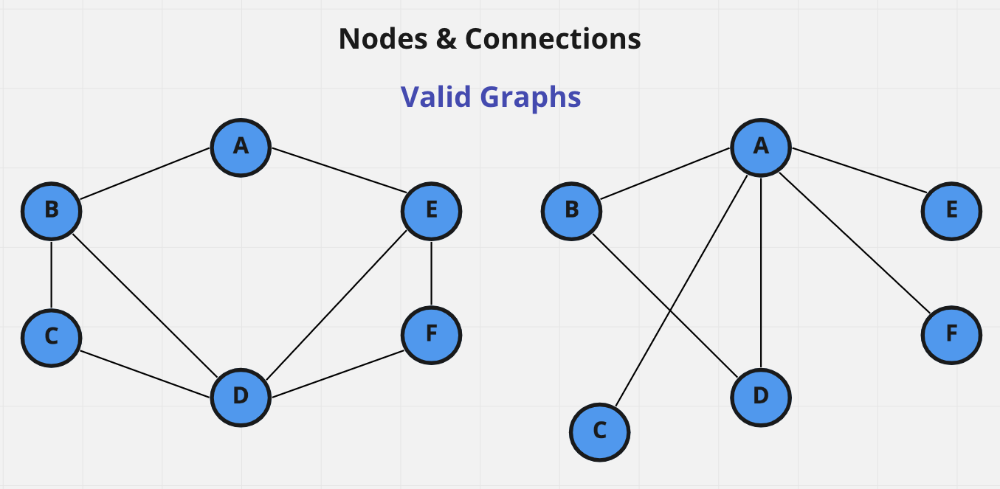
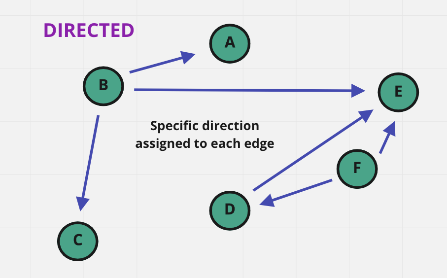
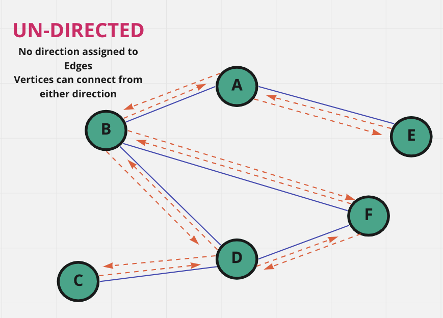
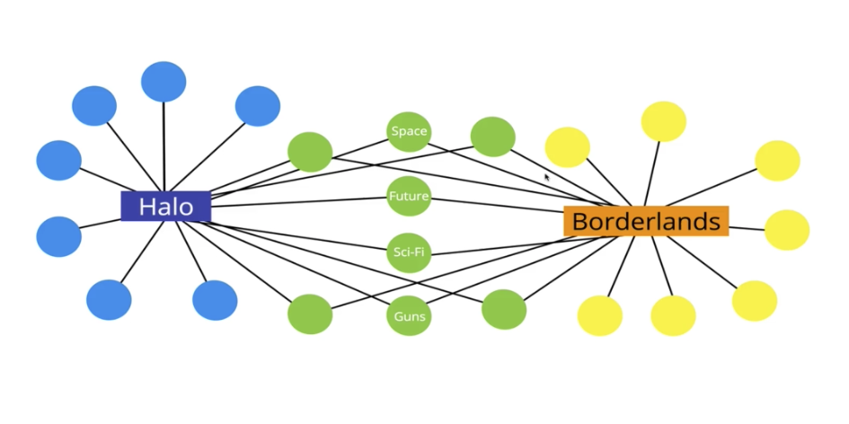

# **Notes - Colt Steele's Class**

## **Data Structures**

## **Graphs**

### **What is a Graph?**

- A Graph is a collection of Nodes and Connections.
- All that is really important are the connections.
- There is no 'root' Node, every Node is created equal.
- They are free-form, there are no patterns.

## **MUST-KNOW Graph Terminology**

### **Vertex**

- This is just graph-speak for a **Node**.

### **Edge**

- These are the connections between the **Nodes**.

### **Weighted / Un-Weighted**

- The value assigned to the distance between Vertices.

#### **Weighted**

#### **Un-Weighted**

### **Directed / Un-Directed**

- Directions assigned to the distances between Vertices.

#### **Directed**

- There is a specific direction assigned to the **Edge** (*the connection between vertices*)
- The direction polarity of that **Edge** is often depicted using arrows.

#### **Un-Directed**

- Bi-Directional, Nodes can establish connections from either direction.
- There is **no direction associated with an Edge**.

### **Uses For Graphs**

- Social Networking (Facebook, Instagram, Twitter, etc.)
- GPS/Location/Mapping (way points linked to destinations, Google Maps, Garmin, etc.)
- Routing Algorithms
- Recommendation Engines (Suggestions on Amazon, Facebook, music streaming sites)
- Visual Hierarchy
- File System Optimizations
- The Internet itself! (page connections, servers to pages, etc.)
- They are extremely common and can be found just about everywhere.

## **Types of Graphs**

