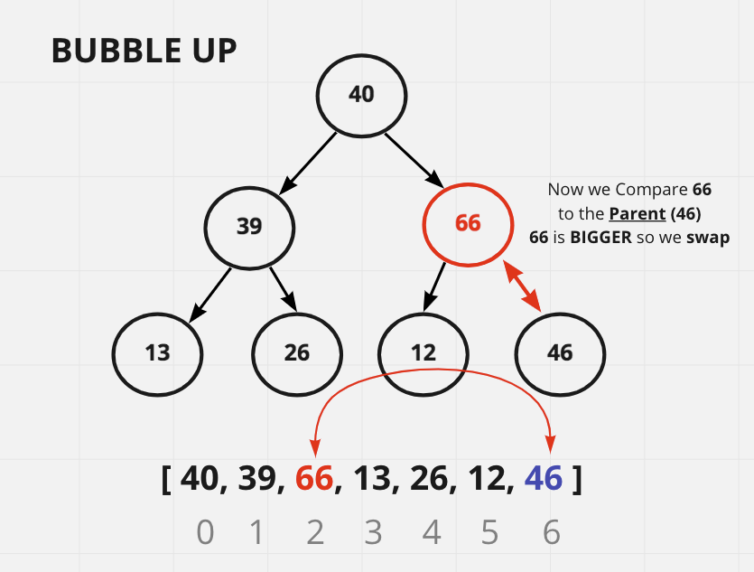

# **Notes - Colt Steele's Class**

## **Data Structures**

## **Heaps**

### The Max Heap

### The Min Heap

### **What is a Heap?**

- These are another category of Trees.
- There are many different types of heaps.

### **What is a Binary Heap?**

- It is a tree structure that is very similar to a BST, but has some different rules.
- First there are two types of BSHs:
  - **MaxBinaryHeap**
    - *Parent* Nodes are *always* **Larger** than *Child* Nodes.
    - **It does not matter which child you are talking about (left or right).**
  - **MininaryHeap**
    - *Parent* Nodes are *always* **Smaller** than *Child* Nodes.
    - **It does not matter which child you are talking about (left or right).**

### Binary Search Tree vs Binary Heap (A visual)

## **Max Binary Heap**

### **The Parent Node is ALWAYS LARGER than the Child Node**

- Each Parent Node has *AT MOST* **TWO** Child Nodes.
- The Value of each Parent Node is **ALWAYS** Greater than that of all Child Nodes.
  - This *does not apply* to the **Siblings**, however.
- A Binary Heap is as compact as possible.
  - All of the Children of each Node are as full as they can be
  - The **Left** Children are filled out **FIRST**.
- **NOTE**
  - The Child Nodes are not necessarily the next smallest numbers of the Parent Node (as shown in the UML below).
  - They must only be LESS than the Parent Node and their Child Nodes must be LESS than them.
  - The *smallest* numbers do not *have* to be only on the left, they just have to be smaller than the Parent.
- **There is no implied ordering in a Binary Heap**

## **Min Binary Heap**

### **The Parent Node is ALWAYS SMALLER than the Child Node**

- Each Parent Node has *AT MOST* **TWO** Child Nodes.
- The Value of each Parent Node is **ALWAYS** Smaller than that of all Child Nodes.
  - This *does not apply* to the **Siblings**, however.
- A Binary Heap is as compact as possible.
  - All of the Children of each Node are as full as they can be
  - The **Left** Children are filled out **FIRST**.
- **NOTE**
  - The Child Nodes are not necessarily the next greatest numbers of the Parent Node (as shown in the UML below).
  - They must only be greater than the Parent Node and their Child Nodes must be greater than them.
  - The *biggest* numbers do not *have* to be only on the right, they just have to be bigger than the Parent.
- **There is no implied ordering in a Binary Heap**

### Why are Heaps Used?

- Binary Heaps are used to implement Priority Queues (commonly used Data Structure).
- Used often for Graph Traversal algorithms.

### Storing Heaps and Finding Nodes

### Finding the Child Node based on the Parent Node

- The Formula to find a Child Node based off a Parent Node:
  - Take the Parent Node (the index) which is (n),
  - Multiply the Parent index (n) by 2 (2n),
  - To find the Left Child, add 1 (2n + 1),
  - To find the Right Child, add 2 (2n + 2).

#### Finding Parent Nodes With Heaps (2n + 1) and (2n + 2) A visual

### Finding the Parent Node based on the Child Node

- The Formula to find a Parent Node based off a Child Node:
  - Take the Child Node (the index) which is (n),
  - Take that Node and subtract 1 (n-1),
  - Divide that by 2 ( (n-1)/2 )
  - Then use Math.floor() to eliminate the decimal.

## **Adding to the Max Binary Heap, the Insert Method**

- New values will be added to the end of the array/list.
- The value will be properly placed by **Bubbling Up**
- **STEPS**
  - Find the parent using the formula,
  - Compare the new *inserted value* to the **Parent**,
    - IF the *inserted value* is **LARGER** than the **Parent**, Swap
    - Else, place the *inserted value* at the end.
  - Compare the **Swapped Parent** value to its New **Parent**
    - IF the *swapped parent* is **LARGER** than the **Parent**, Swap again
    - Else, you are done.

### **Bubbling Up Step By Step Visual**

#### Step One

#### Step Two

#### Step Three

### **The Code Example**

## **Removing from the Max Binary Heap, the ExtractMax Method**

- When removing from a Max Heap, you are removing the Max value (root).
- Conversely, when removing from the Min Heap, you are removing the Min Value but still the Root.

### Sink Down

- The procedure for deleting the Root from the Heap and restoring all the properties.
*Effectively extracting the Maximum element in a Max-Heap or the Minimum element in a Min-Heap*
- There are many ways to say this:
  - Bubble-Down
  - Percolate-Down
  - Sift-Down
  - Trickle-Down
  - Heapify-Down
  - Cascade-Down
  - Extract-Min(or Max)

### Sink Down Step-By-Step (A visual)

#### Step One

- Remove the Root (the maximum (MaxHeap) or minimum (MinHeap) value)

#### Step Two

- Swap the last value with the extracted root.

#### Step Three

- Compare the new Root with its Child.
- If the Child is bigger, swap.

#### Step Four

- Now Compare the Parent to its children
-  If any are larger than the parent - Swap
   -  Else, do nothing. New Paret value stays.
  

#### Step Five

- This is what the completed sinkDown() looks like.

### The Priority Queue

