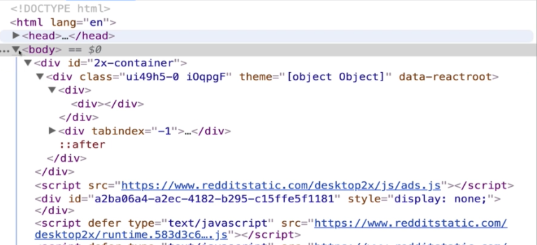
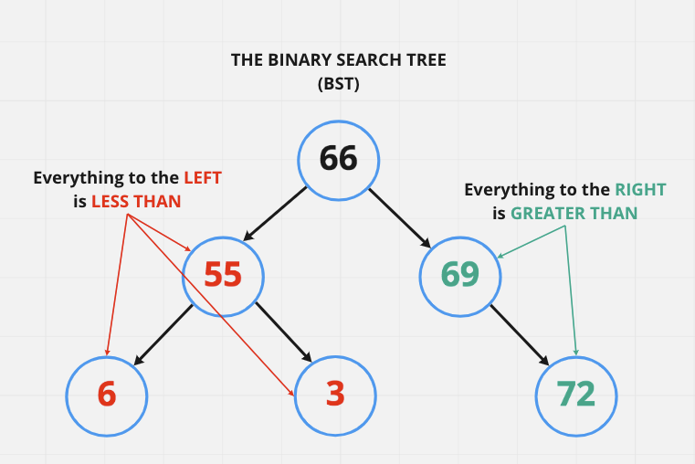
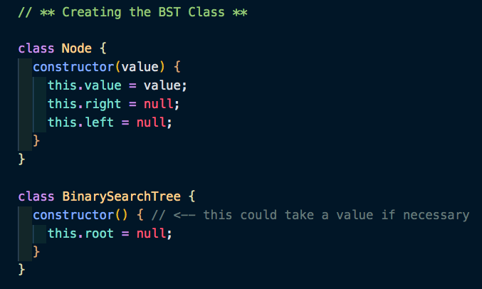
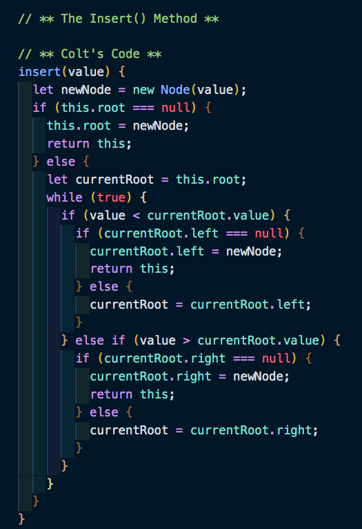
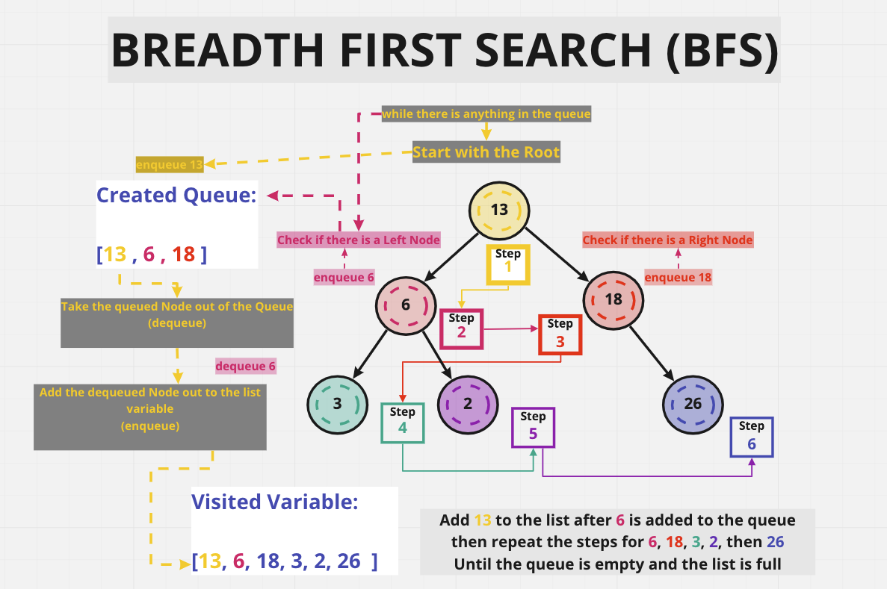

# Notes from Colt's Class

## Data Structures

## Trees

- Data Structures that consist of Nodes in a Parent/Child relationship.
- Trees are non-linear
  - There are many paths you can take 
- Nodes do not point to siblings
- Trees only have one root

#### **ROOT**

- The top of the tree, there is only one root.

#### **CHILD**

- A Node directly connected to another Node when moving away from the Root.

#### **PARENT**

- The converse notion of a child

#### **SIBLINGS**

- A group of Nodes with the same parent.

#### **LEAF**

- Is a Node with no children.

#### **EDGE**

- The connection between one Node and another.

### The Tree - A Visual

### Types of Trees

#### **HTML DOM (Document Object Model)**

#### **Network Routing**

#### **Artificial Inteligence (AI)**

#### **Abstract Syntax Tree**

#### **Folders in Operating Systems**

#### **JSON**

## Binary Search Trees (BST)

- Optimized for searching.
  - Each Node can have at most **TWO** children.
  - Sorted in a *specific* way, kept in an order.
  - Used to store data that can be compared, that is sortable.
- Every Node that is *less* than the Parent Node, is **always** located to the **left**.
- Every Node that is *greater* than the Parent Node, is **always** located to the **right**.

#### Creating the BST class

#### Creating the Tree

### The Insert() Method

#### Code Example

### Searching a BST (or Find, same same)

#### Code Example

### BST BIG-O

#### **Insertion** - **O(log n)**

#### **Searching** - **O(log n)**

#### **NOTE** The above is **NOT** Guaranteed!

- In the unlikely, though possible, event of a ONE-SIDED search tree and you had to traverse and the tree was 1000 Nodes long (or larger even). Your time complexity would increase with the size of the tree, making the **BIG-O** = **O(n)** which is far from ideal.

- Ideally, we would want to reassign the root to be one of the larger values and restructure the BST.
- On **Average** the BIG-O is going to be O(log n) for BST's though.

## Traversing the Trees

### Traversal Methods

### Breadth-First-Search (BFS)

- Searching the breadth of the tree, one layer at a time.
  - Working across the tree.
  - starting at the **root**
  - traverse down to **root.left**,
  - then from **root.left** to **root.right**,
  - then down from **root.left** to **root.left.left**,
  - then across to **root.left.right**,
  - then across to **root.right.left**,
  - then across to **root.right.right**...and so on.

### BFS - Iteratively

1. First step: Create a queue (this can be an array) and a Variable to store the values of Nodes visited (like a sort of to-do list).
2. Place the Root Node in the queue you created.
3. Loop for as long as there is anything in the queue.
   1. Dequeue (*if using an array - this means shifting*) Node from the queue and push the value of the Node into the variable that you created for Node storage (*the list we are returning at the end*).
   2. If there is a Left property on the Dequeued Node - add it to the queue.
   3. If there is a Right property on the Dequeued Node - add it to the queue.

### BFS Step-By-Step Visual

### BFS Code Example

### Depth First Search (DFS)

- Searching the tree by going down, to the end of the tree.
  - traverse down to the end vertically and then coming back up.
- There are three main ways of utilizing the DFS method:

#### 1. DFS - InOrder

#### 2. DFS - PreOrder

#### 3. DFS - PostOrder

