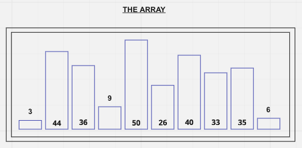
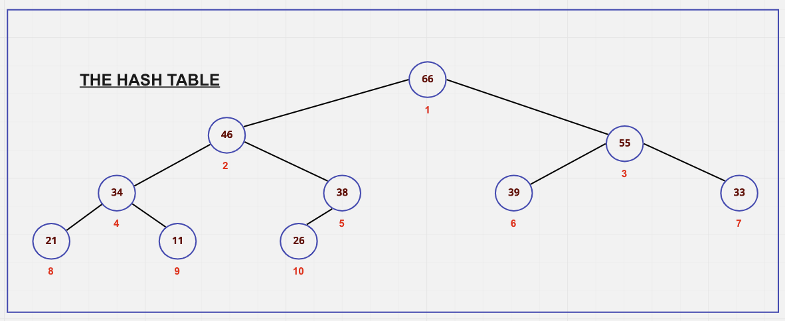
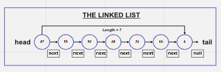
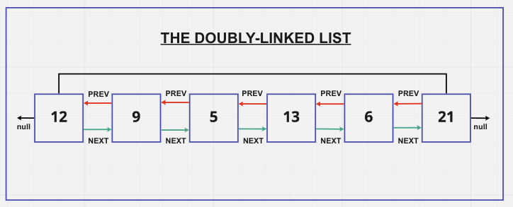

# Notes from Colt's Class

## Data Structures

### What Makes this a data structure?

- they are collections of values
- the relationships among them
- the functions or operations that can be applied to the data

- different data structures excel at different things
- some are highly specialized(like arrays) and are more generally used

### Visual Examples of Data Structures

### Singly Linked Lists

- A data structure that contains a head, tail, and length property
- Linked lists consist of Nodes
  - Each Node has a value and a pointer
  - A pointer or value to another Node or Null
*Like a bunch of train cars connected*

#### Node

- stores a piece of data or a value
- each Node either points to another node
- or if there is no Node - null.

### Singly Linked-Lists BIG-O

#### **Insertion** = O(n)
  
- Takes constant time, regardless of the length of the list

#### **Removal** = can either be O(1) or O(n)

- if removing from the beginning, its constant time
- if from the end, involves list iteration which is O(n)

#### **Searching** = O(n)

- as the list grows, so grows the number of operations

#### **Access** = O(n)

- as the list grows, so grows the number of operations

**Singly Linked Lists excel at insertion and deletion at the beginning vs arrays!**

### Doubly Linked-Lists

- A data structure that contains a head, tail, and length property

- Doubly Linked lists (*similar to singly linked lists*) consist of Nodes
  - Each Node has a value and a pointer
  - A pointer or value to another Node or Null
**BUT**
- Doubly linked lists have an **additional pointer** that points to the next Node **AND** the previous Node.

