# Notes from Colt's Class

## Data Structures

### What Makes this a data structure?

- they are collections of values
- the relationships among them
- the functions or operations that can be applied to the data

- different data structures excel at different things
- some are highly specialized(like arrays) and are more generally used

### Visual Examples of Data Structures

### Singly Linked Lists

- A data structure that contains a head, tail, and length property
- Linked lists consist of Nodes
  - Each Node has a value and a pointer
  - A pointer or value to another Node or Null
*Like a bunch of train cars connected*

#### Node

- stores a piece of data or a value
- each Node either points to another node
- or if there is no Node - null.

### Singly Linked-Lists BIG-O

#### **Insertion** = O(n)
  
- Takes constant time, regardless of the length of the list

#### **Removal** = can either be O(1) or O(n)

- if removing from the beginning, its constant time
- if from the end, involves list iteration which is O(n)

#### **Searching** = O(n)

- as the list grows, so grows the number of operations

#### **Access** = O(n)

- as the list grows, so grows the number of operations

**Singly Linked Lists excel at insertion and deletion at the beginning vs arrays!**

### Doubly Linked-Lists

- A data structure that contains a head, tail, and length property

- Doubly Linked lists (*similar to singly linked lists*) consist of Nodes
  - Each Node has a value and a pointer
  - A pointer or value to another Node or Null
**BUT**
- Doubly linked lists have an **additional pointer** that points to the next Node **AND** the previous Node.

### Doubly Linked-Lists BIG-O

#### **Insertion** = O(1)
  
- Takes constant time, regardless of the length of the list.

#### **Removal** = can either be O(1)

- is **ALWAYS** constant.

#### **Searching** = O(n)

- as the list grows, so grows the number of operations.

#### **Access** = O(n)

- as the list grows, so grows the number of operations.

#### Doubly Linked Lists vs. Singly Linked Lists

- DLL and SLL are almost identical, except the DLL has a pointer to the previous Node. This allows us to access data from the end and work backwards, SLL can only begin from the beginning.
- DLL are better for finding Nodes, and they do it in half the time!
  - That said, the extra pointer *does* take up extra memory, which if space is a concern, this should be accounted for.
**COMMON INTERVIEW QUESTION RESPONSE** DLLs are faster and easier to navigate but they come at a space cost.

### Stacks

- Stacks is a concept and there are multiple ways of using them.
  - Linked Lists
  - Arrays
- A **LIFO** Data Structure
  - Last In First Out
  - The last element added to the stack is the first element removed from the stack.
  - Think of it as a stack of plates, you are gonna remove the first plate on top.

#### Stacks Visual 

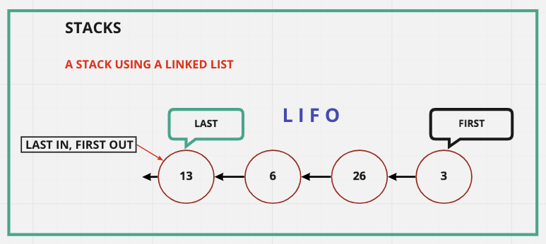
#### How Are Stacks Used?

- Managing Function Invocations
- Undo & Redo Functionality
- Routing (*search history objects*) is treated like a stack
  - The pages you've viewed or the routes you have visited
  - They are also in algorithms to store the history of things you want to come back to
  - A code example:

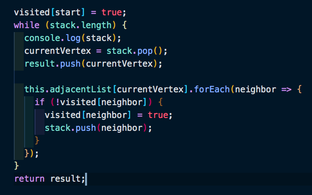

#### Stacks With Arrays 

- Using Arrays are the easiest way to add and remove data from a stack

**Valid Uses for adding and removing data**

- `stack.push` - adds to the end of the array.
- `stack.pop` - removes the last item in the array.
- `stack.shift` - adds to the end of the array.
- `stack.unShift` - removes the last item in the array.
-  A coding example:

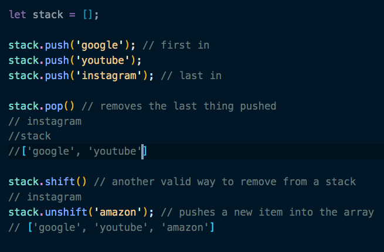

#### Stacks with Linked Lists

- Creating the Stack class.

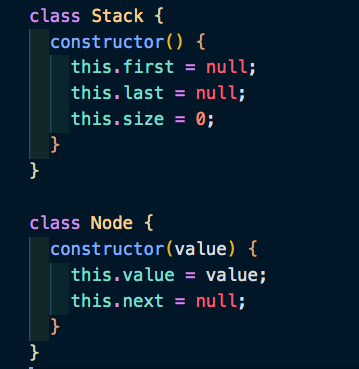

- Using the `Push()` method to add to the Stack list.

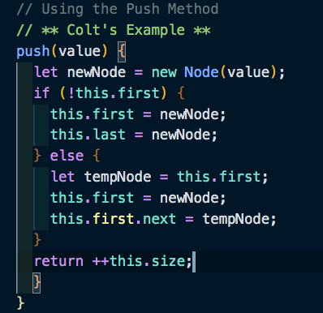

- Using the `Pop()` method to remove the last item from the Stack list.

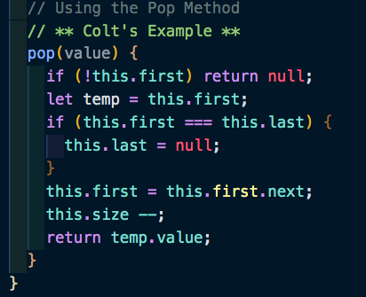

### Stacks BIG-O

#### **Insertion** = O(1)
  
- The `Push()` method is always constant time.
- Takes constant time, regardless of the length of the list.
- We are only pushing to the beginning.

#### **Removal** = can either be O(1)

- The `Pop()` Method is always constant time.
- is **ALWAYS** constant.
- We are only popping (*removing*) from the beginning.

#### **Searching** = O(n) & **Access** = O(n)

- Neither of these are very important at all for Stacks.

### Queues

- Very similar to Stacks in that it is a data structure where you put data in and remove data out.
- Instead of LIFO a queue is **FIFO**
  - First In First Out.
  - The first in the line is the first out the door.

#### How Are Queues Used?

- We use Queues all the time, even outside of the computer
  - If you've ever stood in a line, you were literally in a queue.

- How Queues are used in programming:
  - Background tasks
  - Uploading resources
  - Printing/task processing

#### Queues Visual

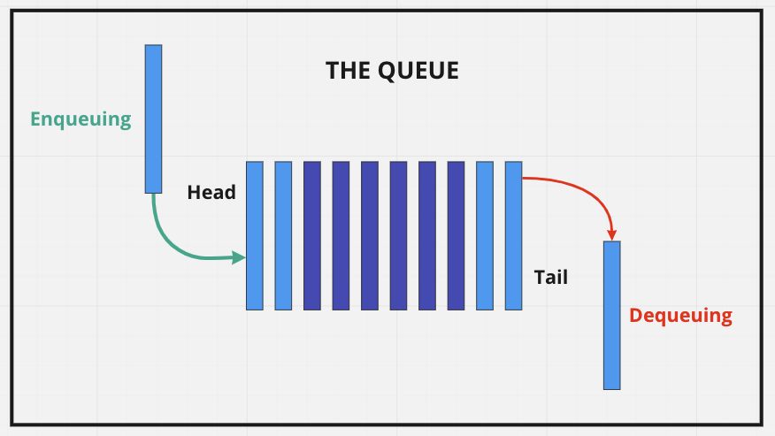

#### Creating a Queue Class

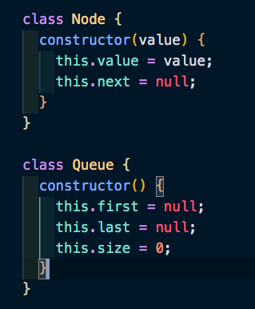

#### Queues Using Arrays

- This is not the Ideal way of using the queue as this requires the entire array to be re-indexed every time something is added.

- Use `Push()` to add to the end coupled with `Shift()` to remove from the beginning.
- Use `Unshift()` to add to the beginning coupled with `Pop()` to remove from the end.

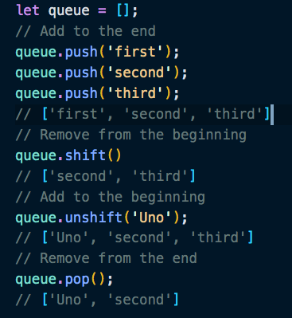

#### Using the Enqueue Method

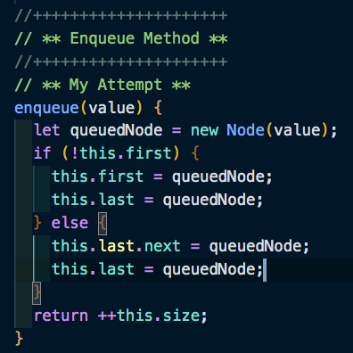

#### Using the Dequeue Method

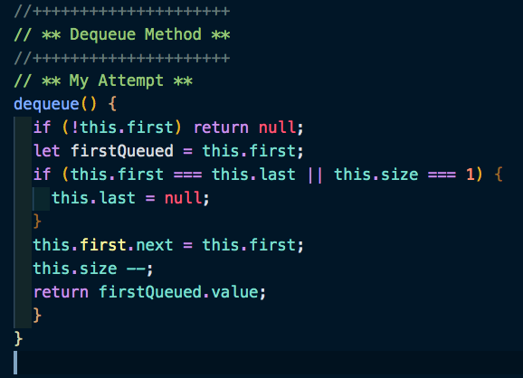

### Queue BIG-O

#### **Insertion - O(1)**

- `enqueue()` is used to insert, and they are constant time.
- In an Array we would use `push()` (to add to the end) and `unshift()` (to add to the beginning) both require the Array to re-index which means it is **O(n)** and not ideal.

#### **Deletion - O(1)**

- `dequeue()` is used to delete from a queue, and it is constant time.
- Again, in an Array we would use `pop()` (to remove from the end) and `shift()` (to remove from the beginning) both require the Array to re-index which means it is **O(n)** and not ideal.

#### **Searching** and **Access** both are **O(n)**

- These aren't very important because, like Stacks, these aren't really used.
