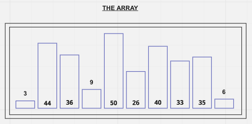
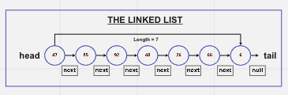
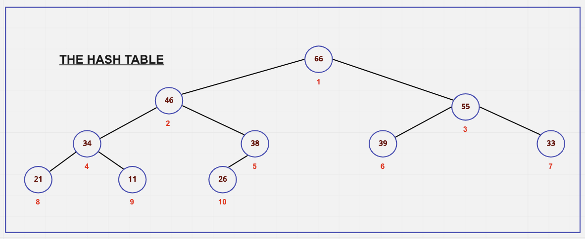

# Notes from Colt's Class

## Data Structures

### What Makes this a data structure?

- they are collections of values
- the relationships among them
- the functions or operations that can be applied to the data

- different data structures excel at different things
- some are highly specialized(like arrays) and are more generally used

### Visual Examples of Data Structures

